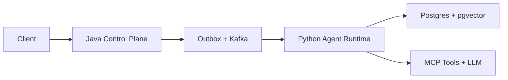

# JourneyWestForge

JourneyWestForge is an interview-oriented engineering laboratory for learning architecture by building, breaking, measuring, and explaining systems.

The repository now has two intentionally separated tracks:

| Track | Runtime | Purpose |
|---|---|---|
| `journeywestforge/` | Java 8 / Spring Boot 2.x | Existing JVM, JMH, RPC, microservice, and system-design experiments |
| `ai-native/` | Python 3.12 now; Java 21 control plane next | Production AI experiments that grow into an enterprise research-agent platform |

The old Java track is kept intact for legacy-system and Java-fundamentals study. The AI-native track is independent because forcing Java 21 and the modern AI stack into the Java 8 parent would blur the compatibility boundary and make both tracks harder to reproduce.

## AI-native target



The target is not a PDF-chat demo. It is a multi-tenant research-task platform with durable task execution, RAG, tool calling, MCP, citations, evaluation, observability, cost controls, and failure recovery.

## What is runnable now

The first AI-native foundation experiments are executable without an LLM key:

- strict Pydantic boundary models and a versioned language-neutral event contract;
- bounded asynchronous tool execution;
- fail-fast structured concurrency;
- timeout and cancellation cleanup tests.

```bash
cd ai-native/python-agent-runtime
python3 -m pip install -e .
PYTHONPATH=src python3 -m unittest discover -s tests -v
```

See:

- [`ai-native/README.md`](ai-native/README.md) for the architecture and local workflow;
- [`ai-native/docs/ARCHITECTURE_REVIEW.md`](ai-native/docs/ARCHITECTURE_REVIEW.md) for the repository assessment;
- [`ai-native/docs/EXPERIMENTS.md`](ai-native/docs/EXPERIMENTS.md) for the experiment backlog and acceptance evidence.

## Engineering rule

Every experiment must answer four questions:

1. What production failure or design uncertainty is being tested?
2. What variable is controlled and what is measured?
3. What automated evidence proves the conclusion?
4. Under what condition would the design need to change?
